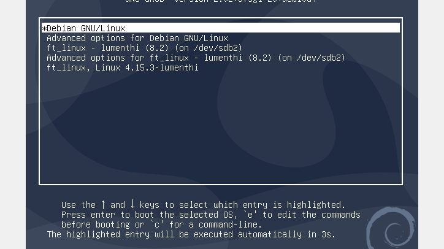

# Linux-From-Scratch
Building your own custom Linux system



## Description
- Unfortunately, due to the size of the image, i'm not able to upload it on github
- Manual written writeup is available through the writeup folder with all detailed steps
### Version
- This system uses a compiled Linux kernel in its version 4.15.3
### Disks
- There are 3 partitions on the system (root, /boot, swap)
```
$ lsblk
NAME   MAJ:MIN RM  SIZE RO TYPE MOUNTPOINT
[...]
sdb      8:16   0   13G  0 disk 
|-sdb1   8:17   0  100M  0 part /mnt/lfs/boot
|-sdb2   8:18   0    9G  0 part /mnt/lfs
`-sdb3   8:19   0  3.9G  0 part [SWAP]
```
### Bootloader
- The distro is booting from grub with the following configuration (40_custom)
```bash
insmod part_gpt
insmod ext2
set root='hd1,gpt1'

menuentry "ft_linux, Linux 4.15.3-lumenthi" {
	linux /vmlinuz-4.15.3-lumenthi root=/dev/sdb2
}
```
### Kernel modules loader
- Kernel modules are managed by udev (https://wiki.debian.org/fr/udev)

### Daemon manager
- This system is based on SysVinit (https://wiki.archlinux.org/title/SysVinit)

## The bible
https://www.linuxfromscratch.org/lfs/
